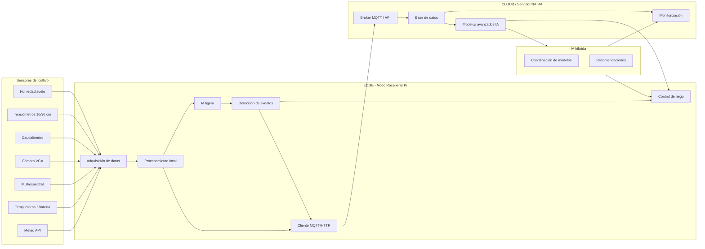

# *Módulo 1 — Introducción al Edge Computing*

## **1. ¿Qué es el Edge Computing?**

El **Edge Computing** es un modelo de procesamiento distribuido en el que los datos se analizan **cerca del lugar donde se generan** —por ejemplo, en una **Raspberry Pi**, un **gateway** o un **microservidor**— en lugar de enviarlos primero a la nube.

Su propósito principal es reducir:

* **latencia**,
* **tráfico de red**,
* **dependencia de conectividad**,
* y mejorar **resiliencia** y **eficiencia energética**.

### En palabras de las principales organizaciones

* **IBM**: destaca la capacidad de ejecutar *inteligencia local* para tomar decisiones inmediatas.
* **Microsoft**: enfatiza su papel en sistemas IoT donde la fiabilidad y la operación autónoma son críticas.

> **Resumen:** el edge acerca la computación al sensor para permitir respuestas rápidas, operar sin internet y enviar a la nube solo lo necesario.

---

## **1.1 Beneficios clave del Edge Computing**

### **1) Procesamiento local**

El nodo procesa los datos **in situ**, reduciendo la dependencia de la nube.

### **2) Baja latencia**

Decisiones críticas pueden ejecutarse en milisegundos:

* activar riego,
* detectar estrés,
* avisar de riesgo de hongo.

### **3) Menor ancho de banda**

En agricultura se generan:

* datos continuos (clima, suelo),
* datos pesados (imágenes, espectros).

El edge permite:

* enviar solo **datos procesados**,
* enviar imágenes **solo cuando hay eventos**,
* evitar saturar redes o enlaces móviles.

### **4) Robustez en zonas sin cobertura**

En entornos agrícolas donde la conexión es irregular, el sistema:

* sigue midiendo,
* sigue actuando,
* y sincroniza datos cuando vuelve la red.

### **5) Seguridad y privacidad**

Los datos sensibles (producción, riego, técnicas de cultivo) se procesan localmente.

---

## **2. Edge Computing en Agricultura**

### **2.1 El campo necesita decisiones en tiempo real**

Ejemplos reales:

* **Humedad del suelo cae por debajo del umbral** → el riego debe activarse inmediatamente.
* **Hoja mojada + baja radiación** → riesgo de hongo, se debe generar una alerta temprana.
* **Viento fuerte** → ajustar o detener el riego por aspersión.

> Si los datos tuvieran que viajar a la nube para decidir, la latencia sería demasiado alta.

---

### **2.2 Poca o nula conectividad real**

En zonas rurales (España y específicamente Canarias), se presentan:

* Cobertura móvil irregular.
* Microcortes frecuentes.
* Restricciones de ancho de banda.

El edge permite seguir funcionando aunque **“no haya internet”**.

---

### **2.3 Los sensores generan muchos datos**

Volumen aproximado:

* Estación meteorológica: cada 5–30 s
* Humedad del suelo y tensiómetro: continuo
* Cámara VGA: decenas de imágenes por hora
* Sensor multiespectral: **muy pesado**

Enviar todo a la nube sería:

* caro,
* lento,
* innecesario,
* poco sostenible.

> **Edge = procesar lo bruto y enviar lo importante (promedios, eventos, alertas).**

---

### **2.4 Analítica agronómica + IA ligera en el borde**

En un nodo edge se pueden calcular:

* balance hídrico,
* estrés hídrico,
* riesgo de enfermedad,
* predicción de humedad del suelo a corto plazo,
* detección de anomalías.

Esto permite **actuar antes de que ocurra el problema**.

---

### **2.5 Reducción de costes y energía**

Procesar localmente:

* reduce uso de red,
* baja almacenamiento cloud,
* evita enviar imágenes pesadas,
* ahorra batería en nodos autónomos.

---

### **2.6 Resiliencia y autonomía**

Un nodo Edge puede:

* seguir midiendo,
* seguir controlando riego,
* seguir detectando eventos,
* seguir tomando decisiones,
* almacenar datos temporalmente,
* y sincronizar cuando vuelva la conexión.

---

## **3. Edge vs Servidor (Cloud)**

El modelo tradicional
**sensor → nube → decisión → acción**
funciona bien en entornos urbanos, pero **fracasa** en agricultura por:

### **1) Latencia alta**

El ciclo completo nube → cálculo → vuelta es demasiado lento para decisiones críticas.

### **2) Dependencia total de conectividad**

Si la red falla (muy común en campo), el sistema queda inutilizado.

### **3) Alto consumo de ancho de banda**

Enviar todos los datos del cultivo → sobrecoste y problemas de cobertura.

### **4) Saturación de datos en la nube**

El cloud se llena de datos irrelevantes, lo que:

* encarece almacenamiento,
* complica análisis,
* introduce ruido,
* reduce sostenibilidad.

> **Conclusión:** la agricultura necesita un modelo híbrido donde el edge procesa y la nube coordina.

---

Perfecto, Jorge.
Aquí tienes la **Sección 5. Arquitectura NAIRA (edge → cloud → IA híbrida)** lista para integrarla dentro del archivo del módulo 1, siguiendo el estilo y convenciones del repositorio. Incluye un **diagrama en Mermaid** que representa el flujo completo *sensor → edge → cloud → IA → acción*.

---

# **5. Arquitectura NAIRA (edge → cloud → IA híbrida)**

La arquitectura NAIRA integra tres niveles de procesamiento:

1. **Edge (borde)** → adquisición, filtrado, analítica local e IA ligera.
2. **Cloud / Servidor NAIRA** → agregación, historización, coordinación y análisis avanzado.
3. **IA híbrida** → combinación de modelos ligeros en el nodo + modelos avanzados (LLMs, predicciones, simulación agronómica) en la nube.

Este enfoque híbrido permite tomar decisiones inmediatas en campo y, al mismo tiempo, disponer de un sistema centralizado para planificación, predicción y gestión del cultivo.

---

## **5.1 Componentes principales**

### **A) Capa Edge (Raspberry Pi / nodo NAIRA)**

Responsabilidades:

* Lectura de sensores (suelo, riego, cultivo, diagnóstico).
* Procesamiento local de señales.
* IA ligera (predicción rápida, detección de eventos).
* Control de actuadores (riego).
* Operación autónoma en modo offline.
* Envío de datos procesados y eventos.

### **B) Capa Cloud / Servidor**

Responsabilidades:

* Broker MQTT y API HTTP.
* Historian de datos (base de datos temporal/series).
* Monitorización de flota de nodos.
* Panel de control y dashboards.
* Integración con modelos avanzados (IA).

### **C) IA Híbrida**

Dos niveles cooperan:

* **IA ligera en el edge:** modelos ONNX, reglas agronómicas, detección simple.
* **IA avanzada en cloud:** predicción de estrés, análisis multivariante, LLMs para interpretación y recomendaciones.

---

## **5.2 Diagrama de arquitectura NAIRA**

> Este diagrama resume cómo fluye la información desde los sensores hasta la toma de decisiones y los actuadores.

---

## **5.3 Flujo de funcionamiento**

1. **Los sensores generan datos** (suelo, clima, riego, cultivo y diagnóstico).
2. **El nodo edge los recibe y procesa** (ruido → filtros → indicadores).
3. **La IA local evalúa eventos** (déficit hídrico, riesgo, anomalías).
4. **El nodo ejecuta acciones rápidas** (activar riego, generar alerta).
5. **Solo se envían datos procesados y eventos** a NAIRA.
6. **El servidor agrupa datos históricos** y ejecuta IA avanzada.
7. **La IA híbrida combina ambos mundos** (local + servidor).
8. **Las recomendaciones del servidor** pueden ajustar reglas del nodo edge.

---

## **5.4 Ventajas del modelo NAIRA**

* Latencia mínima para decisiones críticas.
* Autonomía en zonas con mala conectividad.
* Reducción de costes en comunicaciones y almacenamiento.
* Uso combinado de IA ligera + IA avanzada.
* Flexibilidad para operar con uno o cientos de nodos.
* Sostenibilidad: menor consumo energético y huella digital.

## **5. Referencias recomendadas**

### **Concepto y fundamentos**

* NIST — *Edge Computing Taxonomy*
  [https://www.nist.gov/publications/nist-edge-computing](https://www.nist.gov/publications/nist-edge-computing)
* IBM — *Edge Computing Overview*
  [https://www.ibm.com/cloud/what-is-edge-computing](https://www.ibm.com/cloud/what-is-edge-computing)
* Microsoft — *Azure IoT Edge*
  [https://learn.microsoft.com/azure/iot-edge/](https://learn.microsoft.com/azure/iot-edge/)
* Cisco — *Fog/Edge Architecture*
  [https://www.cisco.com/c/en/us/solutions/internet-of-things/fog-computing.html](https://www.cisco.com/c/en/us/solutions/internet-of-things/fog-computing.html)

### **Aplicado a agricultura**

* FAO — *Digital Agriculture*
  [https://www.fao.org/digital-agriculture](https://www.fao.org/digital-agriculture)
* Microsoft — *AgriTech IoT Edge*
  [https://learn.microsoft.com/azure/architecture/solution-ideas/articles/smart-agriculture](https://learn.microsoft.com/azure/architecture/solution-ideas/articles/smart-agriculture)
* SmartAgriHubs (UE)
  [https://smartagrihubs.eu](https://smartagrihubs.eu)
