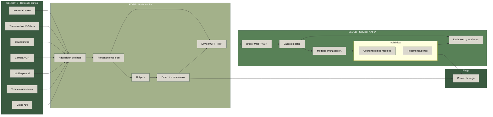
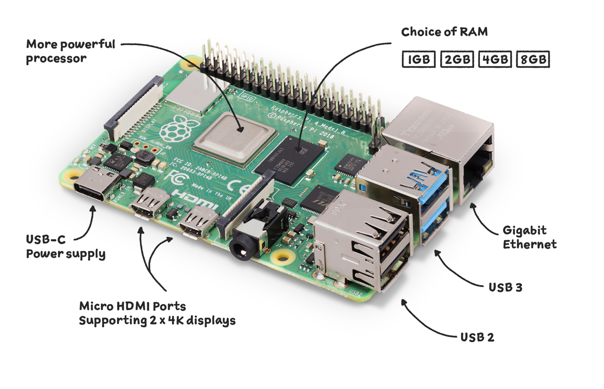
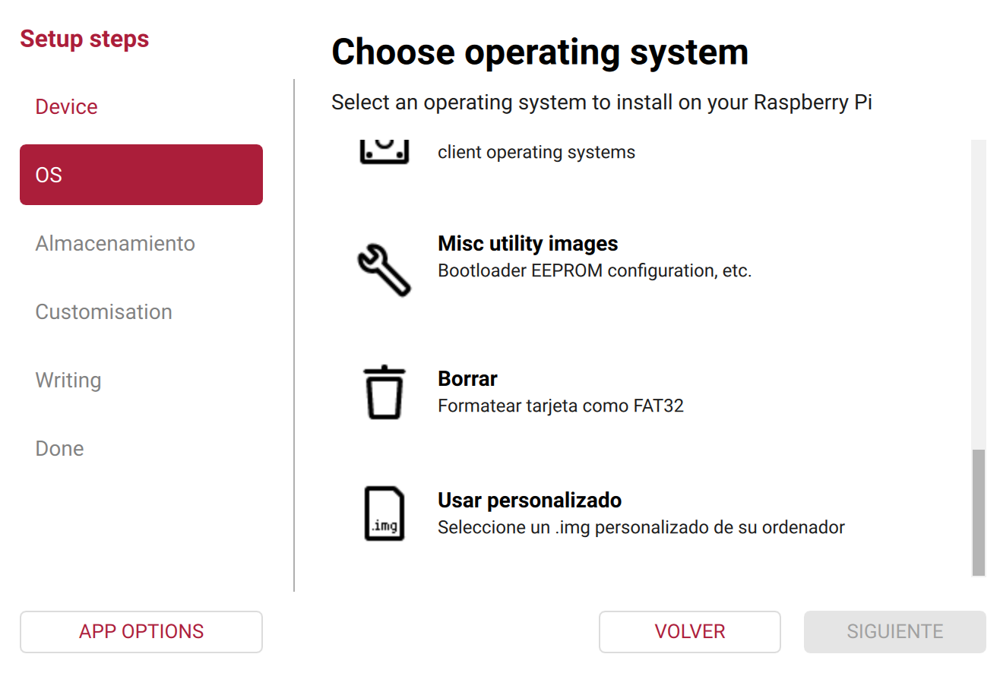
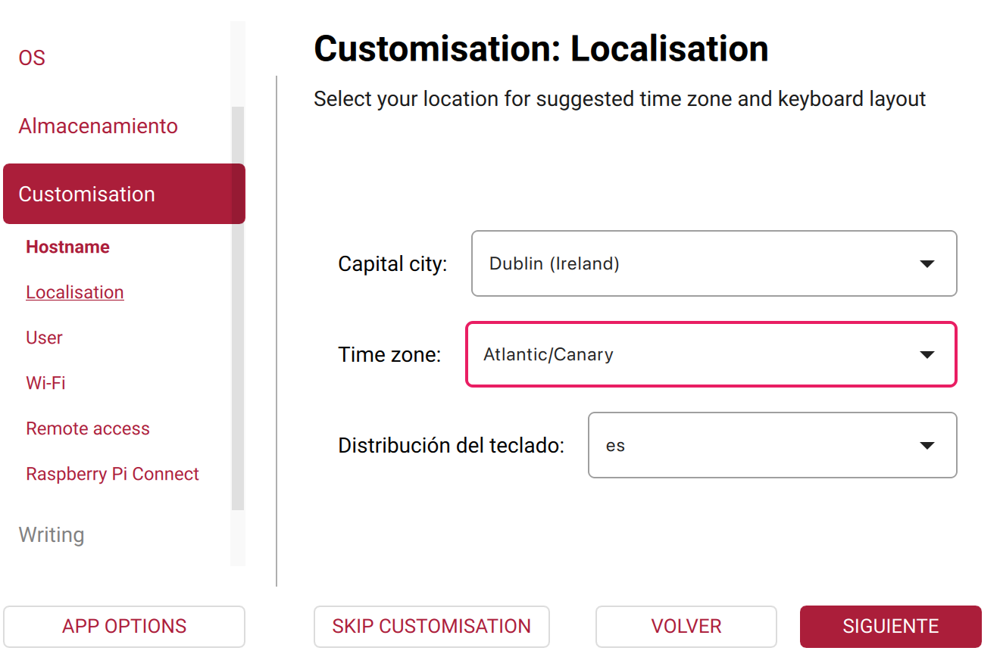
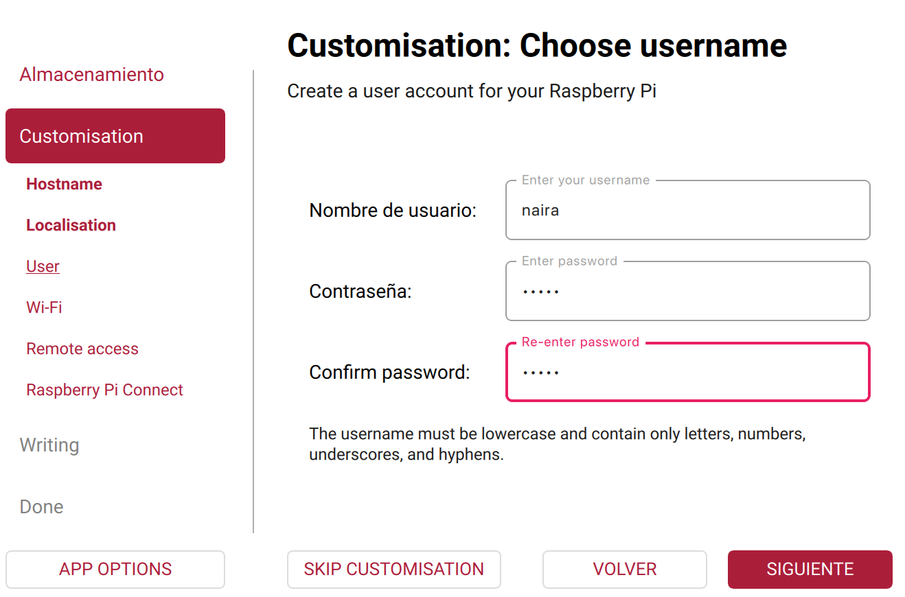
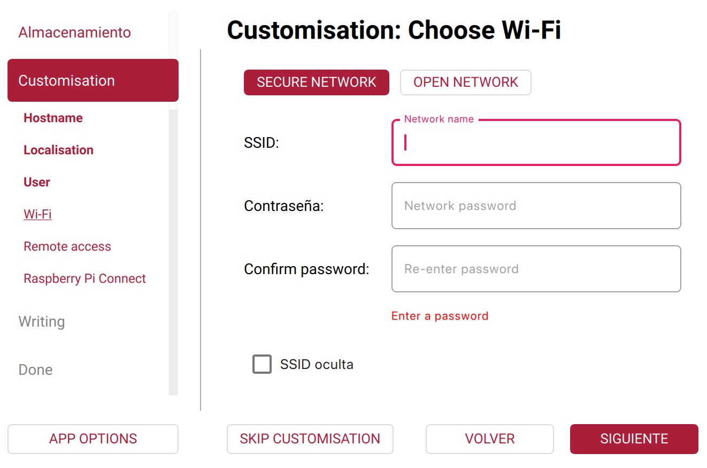
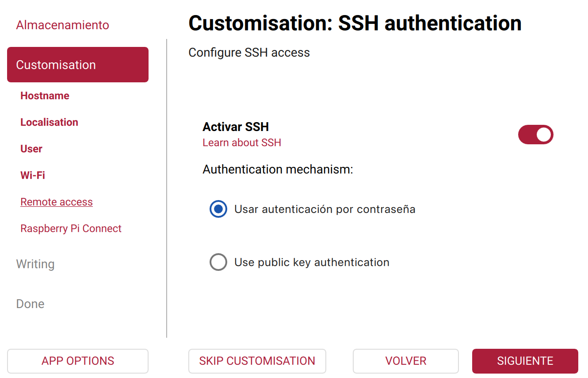
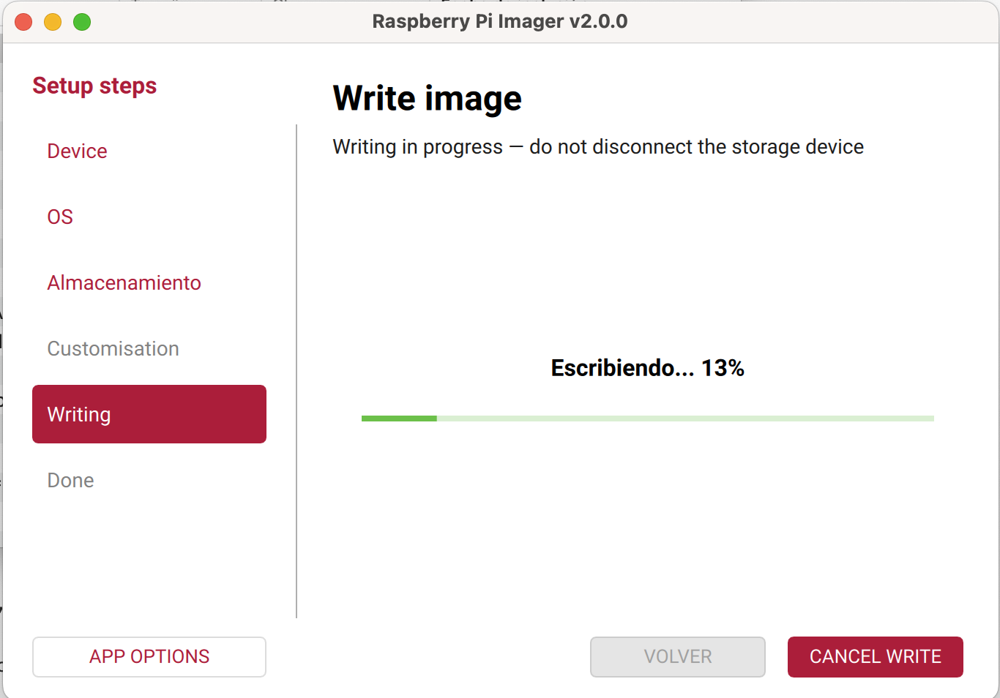

# Contenidos - Módulo 2. Preparación y diagnóstico del nodo

## 0. Contexto

En este módulo se trabaja con un nodo físico basado en **Raspberry Pi 4**, conectado a sensores de campo (por ejemplo, humedad de suelo, temperatura, caudal, presión, etc.) y con conectividad **WiFi/4G** para enviar y consultar datos mediante **APIs**.

El objetivo es que el alumnado pueda:

- Preparar el nodo desde cero (hardware + sistema operativo).
- Configurar la conectividad de red (WiFi y 4G).
- Verificar el funcionamiento de los sensores conectados.
- Implementar pruebas básicas de diagnóstico del nodo y de la conectividad.
- Realizar consultas a una API remota desde el nodo.

---

## 1. Objetivos de aprendizaje

Al finalizar el módulo, el alumnado será capaz de:

1. Identificar los componentes principales de un nodo de Edge basado en Raspberry Pi 4.
2. Instalar y configurar el sistema operativo en la Raspberry Pi para uso como nodo de campo.
3. Configurar la conectividad de red mediante WiFi y/o 4G.
4. Verificar la comunicación con sensores de campo conectados al nodo.
5. Implementar scripts sencillos de diagnóstico de estado del nodo (CPU, RAM, disco, conectividad).
6. Realizar llamadas a una API REST desde el nodo y procesar la respuesta.
7. Documentar la configuración mínima del nodo para su despliegue en campo.

---

## 2. Contenidos

### 2.1. Arquitectura del nodo NAIRA en campo

- Papel del nodo en la arquitectura NAIRA (edge → cloud → IA).
- Funciones del nodo:
  - Adquisición de datos de sensores físicos.
  - Preprocesado ligero de datos.
  - Envío/recepción de datos mediante APIs.
  - Monitorización de estado (health checks).
- Componentes típicos:
  - Raspberry Pi 4 (CPU, RAM, puertos, alimentación).
  - Tarjeta microSD.
  - HATs o placas de expansión para sensores.
  - Módem 4G / router 4G / WiFi.
  - Caja de protección (IP65 o similar) para entornos agrícolas.



### 2.2. Preparación hardware de la Raspberry Pi

- Lista de materiales:
  - Raspberry Pi 4 (modelo y especificaciones mínimas).
   
  - Fuente de alimentación adecuada.
  - Tarjeta microSD (capacidad recomendada).
  - Sensores de ejemplo (humedad de suelo, temperatura, etc.).
  - Interfaz 4G (módem USB o router externo).
- Esquema básico de conexión:
  - Sensores por I2C, 1-Wire, GPIO o UART.
  - Conexión a router 4G o punto de acceso WiFi.
- Buenas prácticas:
  - Identificación y etiquetado de cables.
  - Fijación mecánica y orden de cableado.
  - Consideraciones de protección eléctrica y ambiental.

---

### 2.3 Instalación y configuración del sistema operativo (paso a paso)

En este apartado vamos a dejar la Raspberry Pi 4 lista como **nodo NAIRA**, con:

* Raspberry Pi OS Lite instalado
* Acceso por SSH
* Interfaces de sensores activadas (I2C, SPI, UART/RS485, 1-Wire si aplica)
* Sistema actualizado y mínimamente securizado

#### 2.3.1. Flashear Raspberry Pi OS Lite en la microSD

1. En tu ordenador, instala **Raspberry Pi Imager** (Windows, macOS o Linux).
   * Esposible que sea necesario descargar la imagen desde el sitio web de [Raspberry Pi](https://www.raspberrypi.com/software/operating-systems/):
   
2. Inserta la tarjeta **microSD** en el lector.
3. Abre *Raspberry Pi Imager* y selecciona:
   * **OS** → *Raspberry Pi OS (other)* → **Raspberry Pi OS Lite (64-bit)**. Si has descargado la imagen antes la puedes seleccionar como personalizado:
   
   * **Storage** → tu tarjeta microSD.
4. Pulsa en el icono de **configuración ⚙** (o “Advanced Options”) y marca:
   * Selecciona el nombre del equipo:
   
   * Zona horaria → `Atlantic/Canary`.:
   
   * Usuario: `naira` (o el que se haya definido para el curso).
   * Contraseña: define una contraseña segura.
   
   * Configurar **WiFi** (SSID, contraseña, país) si ya la conoces.
   
   * Activar **SSH**.
   
5. Haz clic en **Write** y espera a que termine el proceso.

6. Expulsa la tarjeta microSD de forma segura.

#### 2.3.2. Primer arranque y acceso por SSH

1. Inserta la microSD en la Raspberry Pi 4.

2. Conecta:

   * Fuente de alimentación,
   * Cable de red (si se va a usar Ethernet) o asegúrate de que hay cobertura WiFi.

3. Espera 1–2 minutos a que arranque.

4. Desde tu portátil, averigua la IP de la Raspberry:

   * Opción A: desde el router (lista de dispositivos conectados).
   * Opción B: usando una herramienta tipo `nmap` en la red local (guiado por el docente).

5. Conéctate por SSH:

   ```bash
   ssh naira@<IP_RASPBERRY>
   ```

   Ejemplo:

   ```bash
   ssh naira@192.168.1.77
   ```

6. Acepta el aviso de seguridad (`yes`) y escribe la contraseña que configuraste en el Imager.

7. Comprueba el nombre del nodo:

   ```bash
   hostname
   ```

#### 2.3.3. Actualización del sistema

1. Actualiza la lista de paquetes:

   ```bash
   sudo apt update
   ```

2. Actualiza los paquetes instalados:

   ```bash
   sudo apt upgrade -y
   ```

3. (Opcional pero recomendable) Reinicia:

   ```bash
   sudo reboot
   ```

   Después del reinicio, vuelve a entrar por SSH.

---

#### 2.3.4. Configuración regional básica

1. Abre la herramienta de configuración:

   ```bash
   sudo raspi-config
   ```

2. Configura:

   * **Localisation Options**:

     * Locale → `es_ES.UTF-8` (si está disponible) o `en_GB.UTF-8`.
     * Timezone → `Europe` → `Madrid`.
     * Keyboard → distribución que uses normalmente.

3. Acepta y sal de la herramienta.

#### 2.3.5. Activar interfaces para sensores

En NAIRA vamos a usar sensores de suelo conectados a la Raspberry Pi a través de **I2C**, conversores **ADC** (SPI o I2C), y posiblemente **UART/RS485**; la estación meteorológica se consultará vía **API**, por lo que **no necesita configuración física** en la Pi.

Para dejar el nodo preparado:

1. Ejecuta:

   ```bash
   sudo raspi-config
   ```

2. Ve a **Interface Options**:

   * **I2C** → Enable

     > Necesario para sensores de humedad de suelo, CE, pH, etc. que usen este bus.
   * **SPI** → Enable

     > Útil si se usan conversores ADC SPI u otros módulos de sensores.
   * **Serial Port**:

     * Login shell sobre serial → **No**
     * Activar hardware serial → **Yes**

     > Esto permite usar el puerto serie para adaptadores **RS485/Modbus**, por ejemplo para tensiómetros, caudalímetros u otros equipos de campo.
   * (Opcional, según sensores definidos en el proyecto) **1-Wire** → Enable

     > Útil si se utilizan sondas de temperatura 1-Wire (p. ej. DS18B20) en suelo o agua.

3. Sal de `raspi-config` guardando los cambios.

4. Reinicia:

   ```bash
   sudo reboot
   ```

#### 2.3.6. Verificar que las interfaces están activas

Tras el reinicio, vuelve a entrar por SSH y comprueba:

1. **I2C**:

   ```bash
   sudo apt install -y i2c-tools
   i2cdetect -y 1
   ```

   * Si ya hay sensores conectados correctamente a I2C, verás sus direcciones (ej. `0x40`, `0x48`, etc.).
   * Si aún no hay sensores, el escaneo puede aparecer vacío, esto es normal.

2. **SPI**:

   ```bash
   ls /dev/spi*
   ```

   * Deberían aparecer dispositivos como `/dev/spidev0.0`.

3. **UART / RS485 (serie)**:

   ```bash
   ls /dev/serial*
   ```

   * Debería aparecer `/dev/serial0` (enlazado habitualmente a `/dev/ttyAMA0` o similar).
   * Si se conecta un adaptador USB–RS485, aparecerá además `/dev/ttyUSB0` (o similar).

4. **1-Wire** (solo si se activó y hay un sensor conectado):

   ```bash
   ls /sys/bus/w1/devices/
   ```

   * Verás un directorio con un identificador que empieza por `28-` si hay sondas DS18B20.

#### 2.3.7. Seguridad mínima del nodo

Antes de empezar a leer sensores en los siguientes apartados, dejamos el nodo con una capa de seguridad básica:

1. Instalar firewall `ufw`:

   ```bash
   sudo apt install ufw -y
   sudo ufw allow ssh
   sudo ufw enable
   ```

2. Instalar `fail2ban` para proteger el acceso SSH:

   ```bash
   sudo apt install fail2ban -y
   sudo systemctl enable fail2ban
   sudo systemctl start fail2ban
   ```

> En módulos posteriores se podrá ampliar la parte de seguridad (VPN, túneles, etc.), pero para este curso nos basta con estas medidas básicas.

Con estos pasos completados, la Raspberry Pi está:

* con **Raspberry Pi OS Lite** instalado,
* accesible por **SSH**,
* lista para usar **I2C, SPI, UART/RS485 y 1-Wire** con los sensores definidos en el proyecto,
* securizada para trabajar en red.

---

### 2.4. Configuración de red: WiFi y 4G

- Configuración de WiFi:
  - Fichero de configuración (`wpa_supplicant.conf` o herramientas equivalentes).
  - Comprobación de IP y conectividad (`ip a`, `ping`).
- Introducción a 4G:
  - Opciones: módem USB 4G vs router 4G externo.
  - Configuración típica (APN, PIN, etc. según proveedor).
  - Verificación de conectividad 4G.
- Estrategias de redundancia:
  - Qué hacer si se pierde WiFi.
  - Pruebas de reconexión automática.
- Seguridad básica:
  - No exponer servicios innecesarios.
  - Actualizaciones periódicas.

### 2.5. Entorno de trabajo para adquisición y diagnóstico

- Preparación del entorno Python:
  - Instalación de Python y `pip` (si no vienen por defecto).
  - Creación de entorno virtual para el proyecto del nodo.
  - Instalación de librerías básicas:
    - `requests` (para APIs),
    - librería de sensores (según ejemplo que se use),
    - herramientas opcionales (p.ej. `gpiozero`).
- Organización del proyecto:
  - Estructura de carpetas recomendada (`/home/pi/naira_nodo/…`).
  - Ficheros de configuración (por ejemplo `config.yaml` o `.env` sencillo).

### 2.6. Lectura y diagnóstico de sensores de campo

- Comprobaciones de bajo nivel:
  - Detección de dispositivos I2C (`i2cdetect`).
  - Verificación de permisos para acceso a GPIO.
- Script sencillo de lectura de un sensor:
  - Leer un valor de ejemplo (temperatura, humedad,…).
  - Mostrar por pantalla, guardar en log o JSON.
- Validación básica de datos:
  - Rangos razonables (ej. temperatura 0–60 ºC, humedad 0–100 %).
  - Gestión de errores (sensor desconectado, lecturas nulas, etc.).

### 2.7. Monitorización y diagnóstico del nodo

- Indicadores de salud del sistema:
  - Uso de CPU y RAM (`top`, `htop`, `free -h`).
  - Espacio en disco (`df -h`).
  - Temperatura de la CPU (comando específico de Raspberry Pi).
- Creación de un script de diagnóstico:
  - Comprobar conectividad a Internet (p. ej. `ping` a una URL).
  - Consultar una API externa de prueba y reportar estado.
  - Generar un resumen en formato JSON con:
    - estado de red,
    - carga del sistema,
    - últimas lecturas de sensores.
- Opciones de automatización:
  - Ejecución periódica con `cron` o `systemd`.
  - Registro en fichero de log.

### 2.8. Acceso a una API desde el nodo

- Conceptos básicos:
  - Qué es una API REST.
  - Métodos principales (GET, POST).
  - Respuestas en formato JSON.
- Ejemplo práctico:
  - Consumir una API sencilla (por ejemplo, meteorología, hora mundial, etc.).
  - Parsear la respuesta y extraer campos relevantes.
  - Combinar datos de sensores con datos de la API en un mismo JSON.
- Aplicación al contexto NAIRA:
  - Uso de datos externos (meteorología, previsión de riego, etc.) para enriquecer la información del nodo.

### 2.9. Buenas prácticas y checklist de despliegue

- Checklist de nodo listo para campo:
  - OS actualizado, credenciales cambiadas.
  - Conectividad WiFi/4G verificada.
  - Sensores probados y con lecturas plausibles.
  - Scripts de diagnóstico funcionando.
- Documentación mínima:
  - Ficha del nodo (ID, ubicación, tipo de sensores).
  - Anotación de parámetros clave (APN, SSID, etc.).
- Recomendaciones para soporte y mantenimiento:
  - Cómo capturar información para soporte remoto.
  - Logs y ficheros útiles en caso de fallo.
