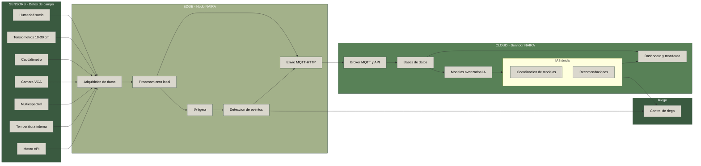

# Contenidos - Módulo 2. Preparación y diagnóstico del nodo

## 0. Contexto

En este módulo se trabaja con un nodo físico basado en **Raspberry Pi 4**, conectado a sensores de campo (por ejemplo, humedad de suelo, temperatura, caudal, presión, etc.) y con conectividad **WiFi/4G** para enviar y consultar datos mediante **APIs**.

El objetivo es que el alumnado pueda:

- Preparar el nodo desde cero (hardware + sistema operativo).
- Configurar la conectividad de red (WiFi y 4G).
- Verificar el funcionamiento de los sensores conectados.
- Implementar pruebas básicas de diagnóstico del nodo y de la conectividad.
- Realizar consultas a una API remota desde el nodo.

---

## 1. Objetivos de aprendizaje

Al finalizar el módulo, el alumnado será capaz de:

1. Identificar los componentes principales de un nodo de Edge basado en Raspberry Pi 4.
2. Instalar y configurar el sistema operativo en la Raspberry Pi para uso como nodo de campo.
3. Configurar la conectividad de red mediante WiFi y/o 4G.
4. Verificar la comunicación con sensores de campo conectados al nodo.
5. Implementar scripts sencillos de diagnóstico de estado del nodo (CPU, RAM, disco, conectividad).
6. Realizar llamadas a una API REST desde el nodo y procesar la respuesta.
7. Documentar la configuración mínima del nodo para su despliegue en campo.

---

## 2. Contenidos

### 2.1. Arquitectura del nodo NAIRA en campo

- Papel del nodo en la arquitectura NAIRA (edge → cloud → IA).
- Funciones del nodo:
  - Adquisición de datos de sensores físicos.
  - Preprocesado ligero de datos.
  - Envío/recepción de datos mediante APIs.
  - Monitorización de estado (health checks).
- Componentes típicos:
  - Raspberry Pi 4 (CPU, RAM, puertos, alimentación).
  - Tarjeta microSD.
  - HATs o placas de expansión para sensores.
  - Módem 4G / router 4G / WiFi.
  - Caja de protección (IP65 o similar) para entornos agrícolas.



### 2.2. Preparación hardware de la Raspberry Pi

- Lista de materiales:
  - Raspberry Pi 4 (modelo y especificaciones mínimas).
   
  - Fuente de alimentación adecuada.
  - Tarjeta microSD (capacidad recomendada).
  - Sensores de ejemplo (humedad de suelo, temperatura, etc.).
  - Interfaz 4G (módem USB o router externo).
- Esquema básico de conexión:
  - Sensores por I2C, 1-Wire, GPIO o UART.
  - Conexión a router 4G o punto de acceso WiFi.
- Buenas prácticas:
  - Identificación y etiquetado de cables.
  - Fijación mecánica y orden de cableado.
  - Consideraciones de protección eléctrica y ambiental.

---

### 2.3 Instalación y configuración del sistema operativo (paso a paso)

En este apartado vamos a dejar la Raspberry Pi 4 lista como **nodo NAIRA**, con:

* Raspberry Pi OS Lite instalado
* Acceso por SSH
* Interfaces de sensores activadas (I2C, SPI, UART/RS485, 1-Wire si aplica)
* Sistema actualizado y mínimamente securizado

#### 2.3.1. Flashear Raspberry Pi OS Lite en la microSD

1. En tu ordenador, instala **Raspberry Pi Imager** (Windows, macOS o Linux).
   * Esposible que sea necesario descargar la imagen desde el sitio web de [Raspberry Pi](https://www.raspberrypi.com/software/operating-systems/):
   
2. Inserta la tarjeta **microSD** en el lector.
3. Abre *Raspberry Pi Imager* y selecciona:
   * **OS** → *Raspberry Pi OS (other)* → **Raspberry Pi OS Lite (64-bit)**. Si has descargado la imagen antes la puedes seleccionar como personalizado:
   
   * **Storage** → tu tarjeta microSD.
4. Pulsa en el icono de **configuración ⚙** (o “Advanced Options”) y marca:
   * Selecciona el nombre del equipo:
   
   * Zona horaria → `Atlantic/Canary`.:
   
   * Usuario: `naira` (o el que se haya definido para el curso).
   * Contraseña: define una contraseña segura.
   
   * Configurar **WiFi** (SSID, contraseña, país) si ya la conoces.
   
   * Activar **SSH**.
   
5. Haz clic en **Write** y espera a que termine el proceso.

6. Expulsa la tarjeta microSD de forma segura.

#### 2.3.2. Primer arranque y acceso por SSH

1. Inserta la microSD en la Raspberry Pi 4.

2. Conecta:

   * Fuente de alimentación,
   * Cable de red (si se va a usar Ethernet) o asegúrate de que hay cobertura WiFi.

3. Espera 1–2 minutos a que arranque.

4. Desde tu portátil, averigua la IP de la Raspberry:

   * Opción A: desde el router (lista de dispositivos conectados).
   * Opción B: usando una herramienta tipo `nmap` en la red local (guiado por el docente).

5. Conéctate por SSH:

   ```bash
   ssh naira@<IP_RASPBERRY>
   ```

   Ejemplo:

   ```bash
   ssh naira@192.168.1.77
   ```

6. Acepta el aviso de seguridad (`yes`) y escribe la contraseña que configuraste en el Imager.

7. Comprueba el nombre del nodo:

   ```bash
   hostname
   ```

#### 2.3.3. Actualización del sistema

1. Actualiza la lista de paquetes:

   ```bash
   sudo apt update
   ```

2. Actualiza los paquetes instalados:

   ```bash
   sudo apt upgrade -y
   ```

3. (Opcional pero recomendable) Reinicia:

   ```bash
   sudo reboot
   ```

   Después del reinicio, vuelve a entrar por SSH.

---

#### 2.3.4. Configuración regional básica

1. Abre la herramienta de configuración:

   ```bash
   sudo raspi-config
   ```

2. Configura:

   * **Localisation Options**:

     * Locale → `es_ES.UTF-8` (si está disponible) o `en_GB.UTF-8`.
     * Timezone → `Europe` → `Madrid`.
     * Keyboard → distribución que uses normalmente.

3. Acepta y sal de la herramienta.

#### 2.3.5. Activar interfaces para sensores

En NAIRA vamos a usar sensores de suelo conectados a la Raspberry Pi a través de **I2C**, conversores **ADC** (SPI o I2C), y posiblemente **UART/RS485**; la estación meteorológica se consultará vía **API**, por lo que **no necesita configuración física** en la Pi.

Para dejar el nodo preparado:

1. Ejecuta:

   ```bash
   sudo raspi-config
   ```

2. Ve a **Interface Options**:

   * **I2C** → Enable

     > Necesario para sensores de humedad de suelo, CE, pH, etc. que usen este bus.
   * **SPI** → Enable

     > Útil si se usan conversores ADC SPI u otros módulos de sensores.
   * **Serial Port**:

     * Login shell sobre serial → **No**
     * Activar hardware serial → **Yes**

     > Esto permite usar el puerto serie para adaptadores **RS485/Modbus**, por ejemplo para tensiómetros, caudalímetros u otros equipos de campo.
   * (Opcional, según sensores definidos en el proyecto) **1-Wire** → Enable

     > Útil si se utilizan sondas de temperatura 1-Wire (p. ej. DS18B20) en suelo o agua.

3. Sal de `raspi-config` guardando los cambios.

4. Reinicia:

   ```bash
   sudo reboot
   ```

#### 2.3.6. Verificar que las interfaces están activas

Tras el reinicio, vuelve a entrar por SSH y comprueba:

1. **I2C**:

   ```bash
   sudo apt install -y i2c-tools
   i2cdetect -y 1
   ```

   * Si ya hay sensores conectados correctamente a I2C, verás sus direcciones (ej. `0x40`, `0x48`, etc.).
   * Si aún no hay sensores, el escaneo puede aparecer vacío, esto es normal.

2. **SPI**:

   ```bash
   ls /dev/spi*
   ```

   * Deberían aparecer dispositivos como `/dev/spidev0.0`.

3. **UART / RS485 (serie)**:

   ```bash
   ls /dev/serial*
   ```

   * Debería aparecer `/dev/serial0` (enlazado habitualmente a `/dev/ttyAMA0` o similar).
   * Si se conecta un adaptador USB–RS485, aparecerá además `/dev/ttyUSB0` (o similar).

4. **1-Wire** (solo si se activó y hay un sensor conectado):

   ```bash
   ls /sys/bus/w1/devices/
   ```

   * Verás un directorio con un identificador que empieza por `28-` si hay sondas DS18B20.

#### 2.3.7. Seguridad mínima del nodo

Antes de empezar a leer sensores en los siguientes apartados, dejamos el nodo con una capa de seguridad básica:

1. Instalar firewall `ufw`:

   ```bash
   sudo apt install ufw -y
   sudo ufw allow ssh
   sudo ufw enable
   ```

2. Instalar `fail2ban` para proteger el acceso SSH:

   ```bash
   sudo apt install fail2ban -y
   sudo systemctl enable fail2ban
   sudo systemctl start fail2ban
   ```

> En módulos posteriores se podrá ampliar la parte de seguridad (VPN, túneles, etc.), pero para este curso nos basta con estas medidas básicas.

Con estos pasos completados, la Raspberry Pi está:

* con **Raspberry Pi OS Lite** instalado,
* accesible por **SSH**,
* lista para usar **I2C, SPI, UART/RS485 y 1-Wire** con los sensores definidos en el proyecto,
* securizada para trabajar en red.

---

### 2.4. Configuración de red: WiFi y 4G

- Configuración de WiFi: Este paso es opcional si previamente has configurado al conectiviad wifi en el instalador
  - Fichero de configuración (`wpa_supplicant.conf` o herramientas equivalentes).
  - Comprobación de IP y conectividad (`ip a`, `ping`).
- Introducción a 4G:
  - Opciones: módem USB 4G vs router 4G externo.
  - Configuración típica (APN, PIN, etc. según proveedor).
  - Verificación de conectividad 4G.
- Estrategias de redundancia:
  - Qué hacer si se pierde WiFi.
  - Pruebas de reconexión automática.
- Seguridad básica:
  - No exponer servicios innecesarios.
  - Actualizaciones periódicas.

### 2.5. Entorno de trabajo para adquisición y diagnóstico

- Preparación del entorno Python:
  - Instalación de Python y `pip` (si no vienen por defecto).
  Para instalar **pip** en una Raspberry Pi (Raspberry Pi OS o cualquier distro basada en Debian), usa este procedimiento seguro y actualizado.
    1. Actualiza los paquetes

    ```bash
    sudo apt update
    ```

    2. Instala pip para Python 3

    ```bash
    sudo apt install python3-pip -y
    ```

    3. Verifica la instalación

    ```bash
    pip3 --version
    ```

    Deberías ver algo como:

    ```
    pip 23.x.x from /usr/lib/python3/dist-packages (python 3.x)
    ```
    4. Alias para usar `pip` directamente (Opcional)

    Si quieres poder escribir solo `pip`:

    ```bash
    echo 'alias pip=pip3' >> ~/.bashrc
    source ~/.bashrc
    ```

    ---

    5. Instalar herramientas útiles (Opcional)

    Si vas a trabajar con entornos virtuales:

    ```bash
    sudo apt install python3-venv python3-dev -y
    ```
  - Creación de entorno virtual para el proyecto del nodo.
  Perfecto, te dejo un **procedimiento limpio, reproducible y adecuado para un nodo NAIRA** en Raspberry Pi, donde vas a usar Python para leer sensores, publicar MQTT, consumir APIs, etc.

  1. Crear el entorno virtual e instalar librerías:

  Desde el directorio `~/naira`:

  ```bash
  cd ~/naira
  python3 -m venv venv
  ```
  Esto crea el entorno en `~/naira/venv/`.

  2. Activar el entorno virtual

  ```bash
  source ~/naira/venv/bin/activate
  ```
  Si funciona, el prompt debe mostrar:

  ```
  (venv) pi@naira:~/naira $
  ```

  3. Actualizar pip dentro del entorno

  ```bash
  pip install --upgrade pip
  ```
  4. Instalar dependencias del nodo

  Para un nodo típico NAIRA (sensores, MQTT, APIs, tiempo real, etc.) te recomiendo este conjunto inicial:

  ```bash
  pip install paho-mqtt requests pyserial python-dotenv
  ```

  Si también usarás Modbus/RS-485:

  ```bash
  pip install pymodbus
  ```

  Si necesitas un scheduler ligero:

  ```bash
  pip install schedule
  ```

  Si procesarás datos localmente:

  ```bash
  pip install pandas
  ```
  5. Congelar dependencias

  Crear o actualizar `requirements.txt`:

  ```bash
  pip freeze > requirements.txt
  ```
  Esto permite:

  * replicar el entorno en otros nodos,
  * reconstruirlo en caso de fallo,
  * garantizar reproducibilidad.

  6. Desactivar el entorno

  Cuando termines:

  ```bash
  deactivate
  ```
- Organización del proyecto:
  - Estructura de carpetas recomendada (`/home/naira/naira_nodo/…`).
  ```
  - main.py – Servicio principal del nodo
  - acquisition/ – Lectura periódica de sensores RS485
  - processing/ – Limpieza, resampling, indicadores agronómicos
  - models/ – Inferencia con modelos ONNX/TinyML
  - comms/ – MQTT, HTTP, almacenamiento offline
  - control/ – Lógica de actuadores (electroválvulas, relés)
  - diagnostics/ – Temperatura, batería, watchdog, logs
  ```
  - Ficheros de configuración (por ejemplo `config.yaml` o `.env` sencillo).

### 2.6. Lectura y diagnóstico de sensores de campo

*(Arduino → Serial → Raspberry Pi)*

En esta sección aprenderás a integrar en la Raspberry Pi un conjunto de sensores que no pueden conectarse directamente al GPIO por ser **analógicos**. Para ello utilizamos un **Arduino como módulo ADC**, que adquiere los datos, los procesa mínimamente y los envía a la Raspberry Pi mediante **Serial USB**.

Este esquema es muy común en agricultura de precisión de bajo coste y facilita:

* aislar eléctricamente los sensores analógicos,
* simplificar el cableado,
* leer múltiples sensores sin necesidad de un MCP3008 o ADS1115,
* delegar en la Raspberry únicamente el procesado, almacenamiento e IA.


#### **2.6.1 Arquitectura de lectura**

```
┌──────────────┐     USB Serial      ┌─────────────────────┐
│   Sensores    │  →→→→→→→→→→→→→→→→  │   Raspberry Pi       │
│  TMP36 (Tª)   │                     │  Nodo NAIRA          │
│  Fototransistor│                    │  - Parser Serial      │
│  Conductividad │                    │  - Validación         │
│  (Moisture)    │                    │  - Diagnóstico        │
└──────┬────────┘                     │  - Publicación datos  │
       │ Analógico                    └───────────────────────┘
┌──────▼────────┐
│    Arduino     │
│  (ADC + loop)  │
└────────────────┘
```

Cada segundo, el Arduino envía tres líneas de texto estructurada.
Ejemplo típico:

```
temperature 23.5
light 4.0
moisture 356.0
```

Donde:

* `temperature` → temperatura TMP36 (°C)
* `light` → nivel de luz (fototransistor, valor 0–1023 o normalizado)
* `moisture` → humedad o conductividad del suelo (0–1 o escala arbitraria)

#### **2.6.2 Firmware básico del Arduino**

Un ejemplo funcional:

```cpp
int lightPin = A0; /*the analog pin the light sensor is connected to */  
int tempPin = A1; /*the analog pin the TMP36's Vout (sense) pin is connected to */  
int moisturePin = A2;  
/* Set this threshold accordingly to the resistance you used */  
/* The easiest way to calibrate this value is to test the sensor in both dry and wet earth */   
void setup() {  
 /* Initialize serial and wait for port to open: */  
 Serial.begin(9600);  
 /* This delay gives the chance to wait for a Serial Monitor without blocking if none is found */  
 delay(1500);    
}  
void loop() {  
 //ArduinoCloud.update();  
 float light = analogRead(lightPin); /* assign light variable to light sensor values */  
 Serial.print("light ");  
 Serial.println(light);
 
 float temperature = get_temperature(); /* assign temperature variable to temperature in Celsius */  
 Serial.print("temperature ");  
 Serial.println(temperature);  
  
 int moisture = get_average_moisture();
 Serial.print("moisture ");  
 Serial.println(moisture);
}

...
```

El código completo está en la carpeta [acquisition](../../src/acquisition) del repositorio.

#### **2.6.3 Lectura desde la Raspberry Pi (Serial USB)**

En la Raspberry Pi, identificamos el puerto USB:

```bash
ls /dev/ttyACM*
ls /dev/ttyUSB*
```

Normalmente:

* `/dev/ttyACM0` → Arduino Leonardo / Micro / Due
* `/dev/ttyUSB0` → Arduino Uno / Nano clon

Instala pyserial:

```bash
pip install pyserial
```

Se ha generado un script para cada dato, en el caso de temperatura **`temp_serial.py`**:

```python
import serial

# Ajusta el puerto si hace falta: suele ser /dev/ttyACM0 o /dev/ttyUSB0
PORT = "/dev/ttyACM0"
BAUDRATE = 9600

def main():
    with serial.Serial(PORT, BAUDRATE, timeout=2) as ser:
        print(f"Leyendo temperatura desde {PORT}...")
        while True:
            line = ser.readline().decode("utf-8", errors="ignore").strip()
            if not line:
                print("WARN: No se reciben datos del Arduino")
                continue

            # Esperamos líneas del tipo: temperature 23.45
            if line.startswith("temperature"):
                try:
                    temp_str = line.split("temperature ")[1]
                    temp_c = float(temp_str)
                    print(f"Temperatura: {temp_c:.2f} °C")
                except ValueError:
                    # línea malformada, la ignoramos
                    pass

if __name__ == "__main__":
    main()

```

#### **2.6.4 Validación y límites aceptables**

La Pi debe asegurar que las lecturas tienen sentido agronómico antes de procesarlas.
Ejemplo de validación:

```python
  if not (0 <= datos["T"] <= 60):
    ok = False
    errores.append("Temperatura fuera de rango")


```
---

#### **2.6.5 Comprobaciones rápidas en campo**

Checklist para garantizar que la adquisición funciona:

| Comprobación      | Comando / Método           | Estado esperado     |
| ----------------- | -------------------------- | ------------------- |
| Arduino detectado | `ls /dev/ttyACM*`          | Puerto presente     |
| Flujo serial      | `screen /dev/ttyACM0 9600` | Datos legibles      |
| Formato correcto  | `T:x;L:x;M:x`              | Sin cortes ni ruido |
| Temperatura       | Mano sobre sensor          | Variación inmediata |
| Luz               | Tapar fototransistor       | Decrece             |
| Conductividad     | Mojar sonda                | Aumenta             |

### 2.7. Monitorización y diagnóstico del nodo

- Indicadores de salud del sistema: *(CPU, RAM, disco y temperatura de la Raspberry Pi)*
  Además de leer sensores externos (temperatura, luz, humedad/CE), es fundamental que el nodo NAIRA supervise **su propio estado interno**. Esto permite:

  * detectar sobrecarga o bloqueos,
  * saber si el nodo corre riesgo de apagarse o sobrecalentarse,
  * registrar anomalías relacionadas con fallos de hardware,
  * planificar mantenimiento y optimizar energía en modo solar/batería.

  **Uso de CPU en tiempo real**

  ```bash
  top
  ```

  Pulsando:

  * `1` → muestra carga por núcleo
  * `q` → salir

  Más visual:

  ```bash
  htop
  ```

  > Si no está instalado:

  ```bash
  sudo apt install htop
  ```

  **Consultar memoria RAM disponible**

  ```bash
  free -h
  ```

  Salida típica:

  ```
                total        used        free      shared  buff/cache   available
  Mem:          3.7Gi       512Mi       2.5Gi       8.0Mi       700Mi       3.1Gi
  ```

  **Espacio en disco**

  Para comprobar si la tarjeta SD está llena:

  ```bash
  df -h
  ```

  Ejemplo:

  ```
  Filesystem      Size  Used Avail Use% Mounted on
  /dev/root        29G  3.1G   24G  12% /
  ```

  Indicadores importantes:

  * `Avail`: espacio disponible
  * `Use%`: si supera el **80 %** puede causar fallos o bloqueos
  
  **Temperatura de la CPU**

  La Raspberry Pi incorpora un sensor interno.
  Comando oficial:

  ```bash
  vcgencmd measure_temp
  ```

  Salida típica:

  ```
  temp=48.3'C
  ```

  Valores orientativos:

  | Temperatura | Estado                                            |
  | ----------- | ------------------------------------------------- |
  | < 60 ºC     | Normal                                            |
  | 60–70 ºC    | Carga alta sostenida                              |
  | > 80 ºC     | Riesgo de *thermal throttling* (baja rendimiento) |
  | > 85 ºC     | Crítico: el sistema puede ralentizarse o apagarse |

  Es importante registrar esta variable cuando:

  * la Pi está al sol,
  * se ejecutan modelos IA TinyML en CPU,
  * se instalan cajas estancas sin ventilación,
  * el nodo funciona en verano en campo real.

  **Interpretación y alertas básicas**

  Puedes aplicar reglas simples:

  * **CPU > 90 % durante 60 s** → riesgo de bloqueo.
  * **RAM < 200 MB** → procesos intensivos pueden fallar.
  * **Disco < 1 GB** → riesgo de corrupción / imposibilidad de loguear.
  * **CPU > 75 ºC** → revisar ventilación o carga del sistema.

  Estas reglas formarán parte del **diagnóstico NAIRA** en módulos siguientes.

- Creación de un script de diagnóstico:
  - Comprobar conectividad a Internet (p. ej. `ping` a una URL).
  - Comprueba valores de Yemperatura y CPU
  ```python
    import psutil, subprocess, json

    def diagnostico_nodo():
        temp_cpu = float(
            subprocess.check_output(["vcgencmd","measure_temp"])
            .decode()
            .replace("temp=","")
            .replace("'C","")
        )

        return {
            "cpu_pct": psutil.cpu_percent(),
            "mem_mb": psutil.virtual_memory().available / 1024 / 1024,
            "temp_cpu": temp_cpu,
        }

    while True:
        info = {
            "timestamp": time.time(),
            "nodo": diagnostico_nodo()
        }

        print(json.dumps(info, indent=2))
    ```

    Esto produce un JSON listo para:

    * MQTT
    * almacenamiento local
    * envío al backend NAIRA

    Una versión más completa del script permirtiría un diagnóstico comopleto del no:
    ```python
    import json
    import os
    import platform
    import socket
    import subprocess
    import time
    from datetime import datetime

    import psutil  # pip install psutil

    # Servicios que queremos comprobar (opcional)
    # Se buscará por nombre de proceso que contenga alguno de estos strings
    WATCHED_SERVICES = [
        "mariadbd", "mysqld",          # MariaDB/MySQL
        "node-red", "node-red-pi",     # Node-RED
        "mosquitto",                   # MQTT (por si acaso)
    ]


    # ---------------------- FUNCIONES DE OBTENCIÓN DE MÉTRICAS ---------------------- #

    def get_uptime_seconds() -> float:
        boot_time = psutil.boot_time()
        return time.time() - boot_time


    def get_cpu_temperature() -> float | None:
        """
        Intenta leer la temperatura de la CPU de la RPi.
        Devuelve temperatura en ºC o None si no se puede obtener.
        """
        # 1) Intentar con vcgencmd
        try:
            out = subprocess.check_output(
                ["vcgencmd", "measure_temp"],
                stderr=subprocess.DEVNULL
            ).decode()
            # formato típico: temp=48.5'C
            if "temp=" in out:
                value = out.strip().split("=", 1)[1].split("'")[0]
                return float(value)
        except Exception:
            pass

        # 2) Intentar con /sys/class/thermal
        try:
            paths = [
                "/sys/class/thermal/thermal_zone0/temp",
                "/sys/class/hwmon/hwmon0/temp1_input",
            ]
            for p in paths:
                if os.path.exists(p):
                    with open(p, "r") as f:
                        raw = f.read().strip()
                        # Suele venir en miligrados (ej: 48567 -> 48.567ºC)
                        val = float(raw)
                        if val > 1000:
                            return val / 1000.0
                        return val
        except Exception:
            pass

        return None


    def get_service_statuses() -> dict:
        """
        Recorre los procesos y marca si los servicios deseados parecen estar activos.
        No usa systemctl, sólo inspección de procesos.
        """
        running_processes = []
        try:
            for p in psutil.process_iter(attrs=["name", "cmdline"]):
                name = p.info.get("name") or ""
                cmd = " ".join(p.info.get("cmdline") or [])
                running_processes.append((name.lower(), cmd.lower()))
        except Exception:
            pass

        statuses = {}
        for svc in WATCHED_SERVICES:
            svc_lower = svc.lower()
            found = any(
                (svc_lower in name) or (svc_lower in cmd)
                for name, cmd in running_processes
            )
            statuses[svc] = "running" if found else "stopped"

        return statuses


    def get_network_stats() -> dict:
        net = psutil.net_io_counters()
        return {
            "bytes_sent": net.bytes_sent,
            "bytes_recv": net.bytes_recv,
            "packets_sent": net.packets_sent,
            "packets_recv": net.packets_recv,
        }


    def collect_metrics() -> dict:
        """
        Recopila todas las métricas de interés de la RPi.
        """
        # CPU
        cpu_percent = psutil.cpu_percent(interval=1.0)
        cpu_count = psutil.cpu_count(logical=True)
        load1, load5, load15 = os.getloadavg()

        # Memoria
        vm = psutil.virtual_memory()
        sm = psutil.swap_memory()

        # Disco (partición raíz)
        disk_root = psutil.disk_usage("/")

        # Temperatura CPU
        cpu_temp = get_cpu_temperature()

        # Uptime
        uptime_seconds = get_uptime_seconds()

        # Red
        net_stats = get_network_stats()

        # Servicios
        services = get_service_statuses()

        # Relación carga / núcleos (load ratio)
        load_ratio = load1 / cpu_count if cpu_count else 0.0

        metrics = {
            "timestamp": datetime.utcnow().isoformat() + "Z",
            "hostname": socket.gethostname(),
            "platform": platform.platform(),
            "cpu": {
                "percent": cpu_percent,
                "count": cpu_count,
                "load_1min": load1,
                "load_5min": load5,
                "load_15min": load15,
                "load_ratio": load_ratio,
                "temperature_c": cpu_temp,
            },
            "memory": {
                "total_bytes": vm.total,
                "used_bytes": vm.used,
                "available_bytes": vm.available,
                "percent": vm.percent,
            },
            "swap": {
                "total_bytes": sm.total,
                "used_bytes": sm.used,
                "free_bytes": sm.free,
                "percent": sm.percent,
            },
            "disk_root": {
                "total_bytes": disk_root.total,
                "used_bytes": disk_root.used,
                "free_bytes": disk_root.free,
                "percent": disk_root.percent,
                "mountpoint": "/",
            },
            "network": net_stats,
            "uptime_seconds": uptime_seconds,
            "services": services,
        }

        return metrics

    def main():
        metrics = collect_metrics()
        print(json.dumps(output, indent=2))
    ```
    Además podríamos añadir al scrip una función de evaluación de alertas:
    ```python
    # ---------------------- CONFIGURACIÓN DE UMBRALES ---------------------- #

    THRESHOLDS = {
        "cpu_percent": {
            "warning": 70.0,
            "critical": 90.0,
        },
        "load_ratio": {  # load_avg_1min / num_cpus
            "warning": 1.0,
            "critical": 2.0,
        },
        "memory_percent": {
            "warning": 75.0,
            "critical": 90.0,
        },
        "swap_percent": {
            "warning": 40.0,
            "critical": 70.0,
        },
        "disk_root_percent": {
            "warning": 75.0,
            "critical": 90.0,
        },
        "cpu_temperature": {
            "warning": 65.0,   # ºC
            "critical": 75.0,
        },
    }

    def evaluate_alerts(metrics: dict) -> list[dict]:
    alerts: list[dict] = []

    # CPU %
    alerts += evaluate_metric("cpu_percent", metrics["cpu"]["percent"], THRESHOLDS)

    # Load ratio (load 1min / núcleos)
    alerts += evaluate_metric("load_ratio", metrics["cpu"]["load_ratio"], THRESHOLDS)

    # Memoria
    alerts += evaluate_metric("memory_percent", metrics["memory"]["percent"], THRESHOLDS)

    # Swap
    alerts += evaluate_metric("swap_percent", metrics["swap"]["percent"], THRESHOLDS)

    # Disco raíz
    alerts += evaluate_metric("disk_root_percent", metrics["disk_root"]["percent"], THRESHOLDS)

    # Temperatura CPU (si disponible)
    alerts += evaluate_metric("cpu_temperature", metrics["cpu"]["temperature_c"], THRESHOLDS)

    # Servicios: generar alertas si están "stopped"
    for svc_name, status in metrics["services"].items():
        if status != "running":
            alerts.append({
                "metric": "service_status",
                "level": "WARNING",
                "service": svc_name,
                "value": status,
                "message": f"Servicio {svc_name} no está en ejecución (estado: {status})",
            })

    return alerts
    ```
    El código completo está disponible en (../src/diagnostics/node_nomitor.py)

- Opciones de automatización:
  - Ejecución periódica con `cron` o `systemd`.
  - Registro en fichero de log.
  Perfecto, vamos a dejarlo programado cada 10 minutos con `cron`.

    1. Localiza la ruta de Python y del script

    En la RPi:

    ```bash
    which python3
    ```

    Te dará algo tipo:

    ```bash
    /usr/bin/python3
    ```

    Supongamos que guardaste el script en:

    ```bash
    /home/pi/rpi_monitor.py
    ```

    (Ajusta la ruta si está en otra carpeta.)

    ---

    2. Edita el crontab del usuario `pi`

    ```bash
    crontab -e
    ```

    Si te pregunta editor, elige `nano` para ir fácil.

    ---

    3. Añade esta línea al final

    Esto ejecuta el script **cada 10 minutos** y guarda la última salida JSON en un fichero:

    ```cron
    */10 * * * * /usr/bin/python3 /home/pi/rpi_monitor.py > /home/pi/rpi_monitor_last.json 2>&1
    ```

    * `*/10 * * * *` → cada 10 minutos
    * `> /home/pi/rpi_monitor_last.json` → sobrescribe el fichero con la última medición
    * `2>&1` → redirige errores al mismo fichero (útil para depurar)

    Guarda y cierra (`Ctrl+O`, Enter, `Ctrl+X` en nano).

    ---

    4. Verificar que cron lo ha aceptado

    Lista las tareas:

    ```bash
    crontab -l
    ```

### 2.8. Acceso a una API desde el nodo

- Conceptos básicos:
  - Qué es una API REST.
  - Métodos principales (GET, POST).
  - Respuestas en formato JSON.
- Ejemplo práctico:
  - Consumir una API sencilla (por ejemplo, meteorología, hora mundial, etc.).
  - Parsear la respuesta y extraer campos relevantes.
  Perfecto, vamos a hacer justo eso: llamar a una API sencilla, parsear la respuesta y guardar un JSON “limpio” con solo los campos que te interesan.

    1. Script de ejemplo: consumir API y guardar JSON

    Guarda esto como `api_worldtime.py`:

    ```python
    #!/usr/bin/env python3
    """
    Ejemplo sencillo:
    - Consume una API pública (WorldTimeAPI).
    - Parsea la respuesta JSON.
    - Extrae campos relevantes.
    - Guarda el resultado en un fichero JSON.
    """

    import json
    from datetime import datetime
    import requests  # pip install requests

    # Configuración
    TIMEZONE = "Atlatinc/Canary"  # cámbialo si quieres otra zona horaria
    API_URL = f"https://worldtimeapi.org/api/timezone/{TIMEZONE}"
    OUTPUT_FILE = "/home/pi/worldtime_last.json"  # ajusta ruta si quieres


    def fetch_time_data() -> dict:
        """Llama a la API y devuelve el JSON original (dict)."""
        resp = requests.get(API_URL, timeout=10)
        resp.raise_for_status()  # lanza error si el status code no es 2xx
        return resp.json()


    def build_clean_payload(raw: dict) -> dict:
        """
        Construye un JSON "limpio" con sólo los campos relevantes
        de la respuesta de WorldTimeAPI.
        """
        return {
            "timestamp_local": raw.get("datetime"),
            "timezone": raw.get("timezone"),
            "abbreviation": raw.get("abbreviation"),
            "unixtime": raw.get("unixtime"),
            "day_of_week": raw.get("day_of_week"),
            "day_of_year": raw.get("day_of_year"),
            "week_number": raw.get("week_number"),
            "dst": raw.get("dst"),
            "raw_offset": raw.get("raw_offset"),
            "dst_offset": raw.get("dst_offset"),
            # Metadata de la captura
            "meta": {
                "source": "worldtimeapi.org",
                "api_url": API_URL,
                "collected_at_utc": datetime.utcnow().isoformat() + "Z",
            },
        }


    def main():
        try:
            raw = fetch_time_data()
            clean_payload = build_clean_payload(raw)

            # Guardar en fichero JSON
            with open(OUTPUT_FILE, "w", encoding="utf-8") as f:
                json.dump(clean_payload, f, indent=2, ensure_ascii=False)

            # También lo mostramos por stdout (útil para Node-RED o logs)
            print(json.dumps(clean_payload, indent=2, ensure_ascii=False))

        except Exception as e:
            # En un sistema real, aquí podrías:
            # - Escribir en syslog
            # - Enviar alerta a MQTT/HTTP
            error_payload = {
                "status": "error",
                "error_type": type(e).__name__,
                "error_message": str(e),
                "api_url": API_URL,
                "collected_at_utc": datetime.utcnow().isoformat() + "Z",
            }
            print(json.dumps(error_payload, indent=2, ensure_ascii=False))


    if __name__ == "__main__":
        main()
    ```
    
    2. Instalar dependencia (`requests`)

    En la RPi:

    ```bash
    sudo apt install python3-pip -y
    pip3 install requests
    ```
    
    3. Probar el script

    ```bash
    python3 /home/pi/api_worldtime.py
    ```

    Deberías ver algo así por pantalla (y en `/home/pi/worldtime_last.json`):

    ```json
    {
      "timestamp_local": "2025-12-11T16:45:12.123456+00:00",
      "timezone": "Europe/London",
      "abbreviation": "GMT",
      "unixtime": 1764847512,
      "day_of_week": 4,
      "day_of_year": 345,
      "week_number": 50,
      "dst": false,
      "raw_offset": 0,
      "dst_offset": 0,
      "meta": {
        "source": "worldtimeapi.org",
        "api_url": "https://worldtimeapi.org/api/timezone/Europe/London",
        "collected_at_utc": "2025-12-11T16:45:12.456789Z"
      }
    }
    ```

- Aplicación al contexto NAIRA:
  - Uso de datos externos (meteorología, previsión de riego, etc.) para enriquecer la información del nodo.

## 3. Buenas prácticas y checklist de despliegue

- Checklist de nodo listo para campo:
  - OS actualizado, credenciales cambiadas.
  - Conectividad WiFi/4G verificada.
  - Sensores probados y con lecturas plausibles.
  - Scripts de diagnóstico funcionando.
- Documentación mínima:
  - Ficha del nodo (ID, ubicación, tipo de sensores).
  - Anotación de parámetros clave (APN, SSID, etc.).
- Recomendaciones para soporte y mantenimiento:
  - Cómo capturar información para soporte remoto.
  - Logs y ficheros útiles en caso de fallo.
